# AI Foam Cut – Benutzerhandbuch

**Tragflächen- und Formenbau mit dem 4-Achs-Heißdraht-CNC**

Programmstand: September 2026. Laufende Änderungen stehen im [CHANGELOG](CHANGELOG.md). Alle Bilder liegen im Ordner `handbuch_bilder/` und stammen aus der aktuellen Programmversion. Als Beispiel dient durchgehend eine Discus-Tragfläche (aus XFLR5 importiert).

---

## Grüß Euch!

Einige haben ja schon mitbekommen, dass ich mit Hilfe von KI an einer neuen Softwarelösung fürs CNC-Heißdrahtschneiden arbeite. Mit ein paar fleißigen Testern ist das Programm inzwischen an einem Punkt angelangt, an dem die Entwicklung als fertig betrachtet werden kann. In diesem Handbuch geht es deshalb nicht mehr ums Testen, sondern um die Anwendung: Was kann das Programm, wo findet man was, und wie kommt man vom Entwurf zum fertigen Kern?

Ich gehe die Module der Reihe nach durch, ungefähr so, wie man auch beim Arbeiten vorgeht. Wer nur etwas nachschlagen will, springt über das Inhaltsverzeichnis direkt ins passende Kapitel.

## Inhalt

1. [Der Aufbau des Programms](#1-der-aufbau-des-programms)
2. [Laden, Speichern und Einstellungen](#2-laden-speichern-und-einstellungen)
3. [Die Werkstoffdatenbank](#3-die-werkstoffdatenbank)
4. [Die Projektübersicht](#4-die-projektübersicht)
5. [Der Tragflächendesigner](#5-der-tragflächendesigner)
6. [Das Kerndesign](#6-das-kerndesign)
7. [Das Negativschalendesign](#7-das-negativschalendesign)
8. [DXF-Formen – komplexe Formen wie Rümpfe](#8-dxf-formen--komplexe-formen-wie-rümpfe)
9. [3D-Modell – vom STL zur Styroporscheibe](#9-3d-modell--vom-stl-zur-styroporscheibe)
10. [Schriften](#10-schriften)
11. [Die Spezialmodule](#11-die-spezialmodule)
12. [G-Code und Simulation](#12-g-code-und-simulation)
13. [Schneiden](#13-schneiden)
14. [Maschine](#14-maschine)
15. [Anhang: Tipps, Tastenkürzel, Dateiformate](#15-anhang-tipps-tastenkürzel-dateiformate)

---

## 1. Der Aufbau des Programms

Als Erstes soll es darum gehen, wie das Programm aufgebaut ist.

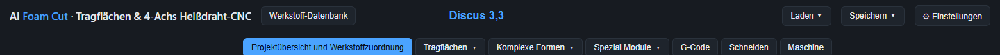

Im **obersten Bereich** findet sich links die **Werkstoff-Datenbank**, in der Mitte der **Projektname** und rechts die Funktionen **Laden**, **Speichern** und die **Einstellungen**.

In der **Zeile darunter** finden sich die einzelnen Module. Damit die Leiste nicht zu lang wird, sind zusammengehörige Module in Aufklappmenüs gebündelt:

| Eintrag | Enthält |
|---|---|
| **Projektübersicht und Werkstoffzuordnung** | Alle Tragflächen des Projekts, Werkstoff und Blockdicke je Tragfläche, Gewichtsschätzung, Schneideinstellungen |
| **Tragflächen ▾** | Tragflächendesigner, Negativschalendesign, Kerndesign |
| **Komplexe Formen ▾** | DXF-Formen, 3D-Modell, Schriften |
| **Spezial Module ▾** | Rippendesigner, CAD-Bearbeitung, Formenbau |
| **G-Code** | Maschinenprogramm erzeugen und in 3D simulieren |
| **Schneiden** | Blockzuschnitt, Abbrand-Kalibrierung, Programm an die Maschine schicken |
| **Maschine** | Maschinengeometrie, Verbindung, Referenzfahrt, Handfahrt, Drahtheizung |

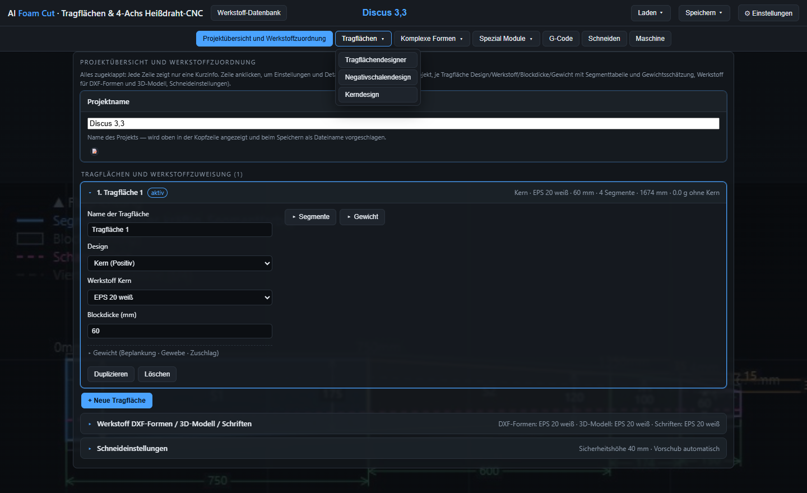
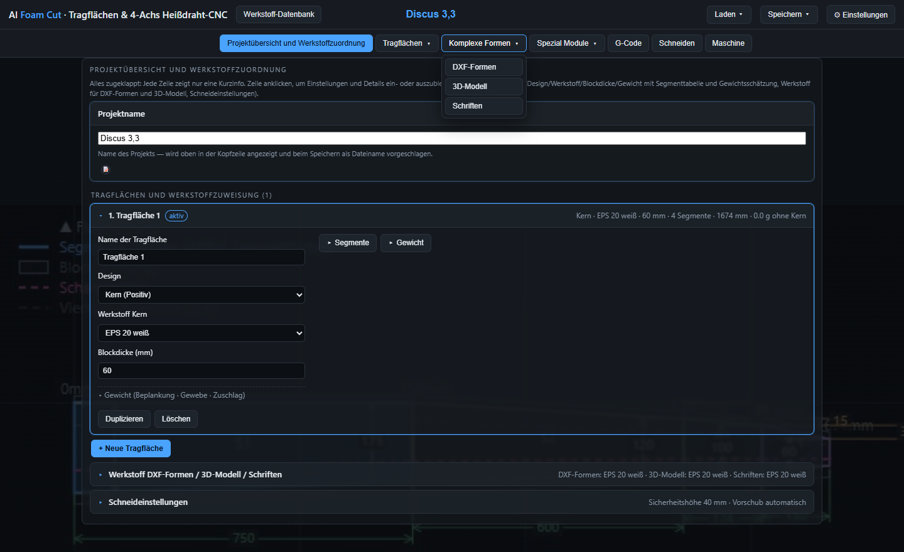
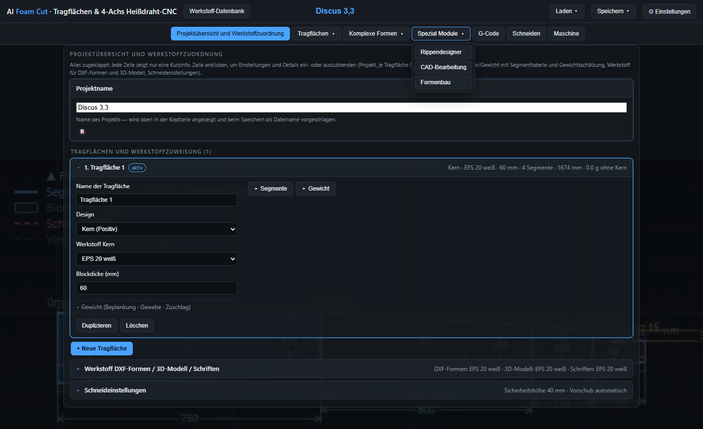

Ist ein Modul aus einem Menü gewählt, steht sein Name direkt im Menüknopf (z. B. „Tragflächen · Kerndesign“). So sieht man immer, wo man gerade ist. Wem die Gliederung nicht gefällt, der kann sie unter *⚙ Einstellungen → Menüleiste* frei umbauen: Menüs umbenennen, Module verschieben oder wieder als eigenen Reiter nach oben holen.

Unterhalb der Reiterleiste ist jedes Modul gleich aufgebaut:

- **Links die Seitenleiste** mit allen Eingaben, sortiert in aufklappbare Gruppen mit farbigem Rahmen. Ein Klick auf die Überschrift klappt eine Gruppe auf oder zu, das Programm merkt sich den Zustand.
- **Rechts die Zeichenfläche** mit Grundriss, Profilen, 3D-Ansicht oder Simulation. Kleine Schaltboxen in der Zeichenfläche lassen sich am ⠿-Griff verschieben, die Trennlinien zwischen den Fenstern mit der Maus.

Ein paar Dinge gelten überall:

- **Mausrad** zoomt auf den Mauszeiger, **Ziehen** verschiebt, **Doppelklick** setzt die Ansicht zurück. In 3D-Ansichten dreht Ziehen, Shift+Ziehen verschiebt.
- **Zahlenfelder** nehmen Punkt und Komma, Änderungen wirken sofort auf Zeichnung und G-Code.
- Zu fast jedem Feld gibt es einen **Hinweistext**. Wer die Texte nicht dauernd sehen will, stellt sie in den Einstellungen auf „erst über ? aufklappen“.
- Das kleine **📝-Symbol** neben einem Feld ist eine **Notiz**: Dort kann man sich eigene Anmerkungen hinterlegen, die mit dem Projekt oder den Einstellungen gespeichert werden.
- **Strg+S** speichert das Projekt, **Strg+G** springt zum G-Code, **Strg+C** im G-Code-Reiter weiter zum Schneiden (alle Kürzel im Anhang).

---

## 2. Laden, Speichern und Einstellungen

### 2.1 Laden

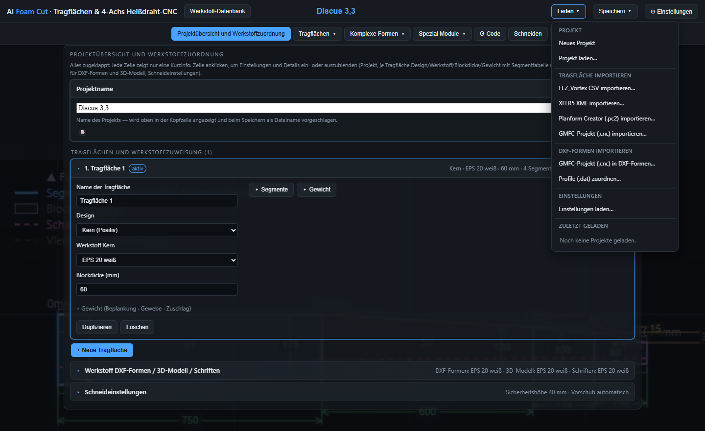

Es können die **nativen gespeicherten Projekte**, aber auch **Tragflächen aus FLZ_Vortex, XFLR5, Planform Creator und GMFC** geladen werden. Auch **komplexe Formen wie Rümpfe** können als GMFC-Projekt geladen werden. Weiters können abgespeicherte **Programmeinstellungen** geladen werden.

Im Einzelnen:

- **Neues Projekt** – verwirft das aktuelle Projekt. Maschinen-Einstellungen und Werkstoffe bleiben natürlich erhalten.
- **Projekt laden…** – ein mit AI Foam Cut gespeichertes Projekt (`.json`) mit allem, was dazugehört: Tragflächen, Kern-, Negativ-, DXF- und 3D-Modell-Daten.
- **Tragfläche importieren**
    - **FLZ_Vortex CSV** – Sehnen, Spannweiten, Pfeilung und Schränkung aus dem Geometrie-Export.
    - **XFLR5 XML** – die Planform aus einer XFLR5-Flügel-XML (Sehnen, Spannweiten, Pfeilung, V-Form, Schränkung).
    - **Planform Creator (.pc2)** – glatte oder elliptische Flächen; ein Dialog zerlegt sie in eine wählbare Anzahl Trapez-Segmente.
    - **GMFC-Projekt (.cnc)** – eine in GMFC angelegte Tragfläche wird mit Segmenten und Profilen übernommen.
- **DXF-Formen importieren**
    - **GMFC-Projekt (.cnc) in DXF-Formen** – beliebige GMFC-Formen, z. B. Rümpfe, kommen als Konturpaare in das Modul DXF-Formen (Kapitel 8).
    - **Profile (.dat) zuordnen…** – viele Profildateien auf einmal wählen und den Segmenten zuordnen. Die Zahl in Klammern sagt, wie viele Profile noch fehlen. Beim XFLR5-Import sind das die Profile, deren Namen in der XML stehen.
- **Einstellungen laden…** – Maschinendaten, Werkstoffe, Farben.
- **Zuletzt geladen** – die letzten Projekte zum direkten Öffnen.

Alle Lade- und Speicherfunktionen öffnen den gewohnten Windows-Explorer-Dialog. Das Programm merkt sich je Dateityp den zuletzt benutzten Ordner.

### 2.2 Speichern

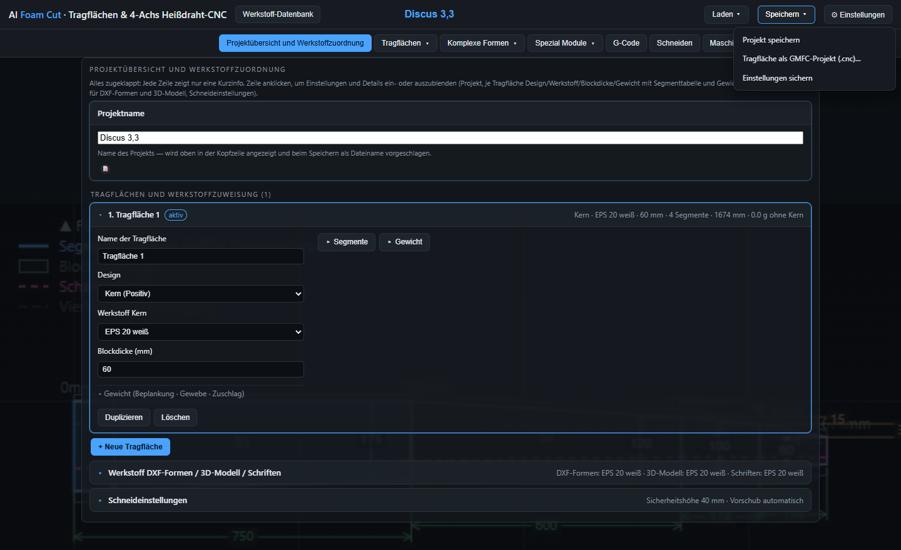

- **Projekt speichern** – der komplette Entwurf als `.json` (auch Strg+S).
- **Tragfläche als GMFC-Projekt (.cnc)…** – wer parallel noch mit GMFC arbeitet, kann die Tragfläche dorthin übergeben.
- **Einstellungen sichern** – Maschine, Werkstoffe samt Kalibrierung und Farben als `hotwing-settings.json`. Liegt diese Datei im Programmordner, wird sie beim Start automatisch angeboten. Wer mehrere Maschinen hat, legt einfach mehrere Einstellungsdateien an und wählt beim Start die passende.

Wichtig: **Werkstoffe und Maschine gehören zu den Einstellungen, nicht zum Projekt.** Nach dem Kalibrieren also unbedingt *Einstellungen sichern*.

### 2.3 Einstellungen

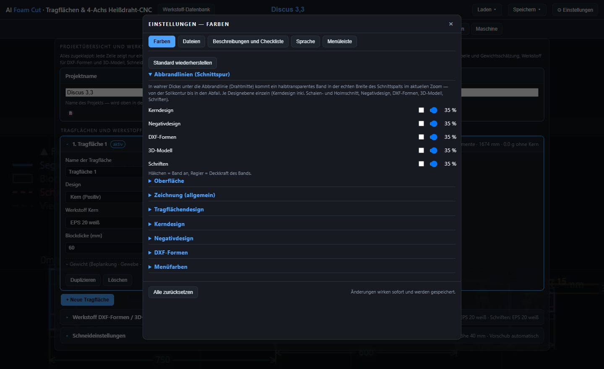

Der Knopf **⚙ Einstellungen** rechts oben öffnet einen Dialog mit mehreren Reitern:

- **Farben** – Farben und Strichtypen je Ansicht (Tragfläche, Kern, Negativ, DXF …), Rahmenfarben der Seitenleisten-Gruppen und das halbtransparente Abbrand-Band, das die echte Breite des Schnittspalts zeigt.
- **Dateien** – Startordner je Dateityp. Mit **Ordnerbaum anlegen…** legt das Programm unter einem gewählten Ordner (Empfehlung: *Dokumente\AI Foam Cut*) die Unterordner Projekte, Einstellungen, Werkstoffe, G-Code, Profile, DXF, STL usw. an und stellt alles darauf ein.
- **Beschreibungen und Checkliste** – Hinweistexte immer zeigen oder erst per „?“ aufklappen, Notizsymbol ein/aus.
- **Sprache** – Deutsch oder Englisch, wirkt sofort auf Oberfläche, Hinweise und G-Code-Kommentare.
- **Menüleiste** – die Gliederung der Reiterleiste (siehe Kapitel 1).

---

## 3. Die Werkstoffdatenbank

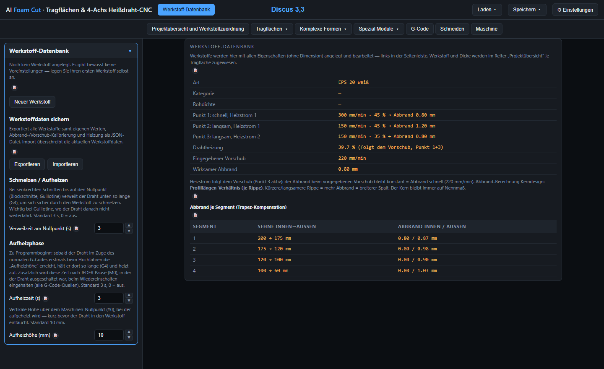

Die Werkstoffdatenbank ist bewusst **leer**. Es gibt keine Voreinstellungen, nicht einmal Namen, denn jeder hat seinen eigenen Schaum, seinen eigenen Draht und seine eigene Heizung. Mit **Neuer Werkstoff** legt man einen Eintrag an (z. B. „XPS 30 blau“) und trägt Kategorie und Rohdichte ein. Die Rohdichte braucht die Gewichtsschätzung in der Projektübersicht.

Das Herzstück ist der **Abbrand**, also die Breite des Schnittspalts. Er hängt vom Schaum, von der Drahttemperatur und vom Vorschub ab: langsam = breiter Spalt, schnell = schmaler. Deshalb wird jeder Werkstoff mit **drei Kalibrierpunkten** eingemessen: Punkt 1 (schnell) und Punkt 2 (langsam) mit gleichem Heizstrom ergeben die Abbrand-Gerade über den Vorschub. Der optionale Punkt 3 (langsam mit geringerem Heizstrom) ergibt eine Heizstrom-Gerade, mit der die Drahtheizung dem Vorschub folgt und der Abbrand konstant bleibt. Die Tabelle rechts zeigt alle drei Punkte mit Vorschub, Heizung und Abbrand. Rechts in der Tabelle sieht man für das aktuelle Projekt gleich, welcher Abbrand an Wurzel und Rand jedes Segments wirkt. Bei Trapezflächen ist die kürzere Rippe langsamer und brennt dadurch breiter; das wird automatisch ausgeglichen.

Solange ein Werkstoff nicht kalibriert ist, rechnet das Programm mit Abbrand 0 und warnt mit „⚠ Nicht kalibriert“. Wie die Kalibrierung geht, steht in Abschnitt [13.2](#132-abbrand-kalibrieren).

Weitere Felder in der Seitenleiste:

- **Heizstrom 1 / Heizstrom 2** – die Heizleistung der Kalibrierpunkte (wird als `M3 S…` ausgegeben). Mit **Heizstrom vorschubabhängig (Punkt 3 aktiv)** folgt die Heizung dem Vorschub, sonst ist sie konstant gleich Heizstrom 1.
- **Verweilzeit am Nullpunkt** – bei senkrechten Schnitten bis ganz unten (Blockschnitte, Guillotine) wartet der Draht kurz, damit er sicher durchschmilzt.
- **Aufheizzeit / Aufheizhöhe** – zu Programmbeginn und nach jeder Pause heizt der Draht kurz vor dem Eintauchen auf.
- **Exportieren / Importieren** – alle Werkstoffe als eigene Datei sichern oder weitergeben.

---

## 4. Die Projektübersicht

Der erste Reiter ist die Zentrale des Projekts. Hier steht alles auf einen Blick, jede Zeile lässt sich aufklappen:

- **Projektname** – wird oben in der Kopfzeile gezeigt und beim Speichern als Dateiname vorgeschlagen.
- **Tragflächen und Werkstoffzuweisung** – ein Projekt kann **mehrere Tragflächen** enthalten, z. B. Flügel, Höhenleitwerk und Seitenleitwerk. Je Tragfläche wählt man:
    - **Design** – *Kern (Positiv)* oder *Negativschale*,
    - **Werkstoff** und **Blockdicke**,
    - **Segmente** – Tabelle aller Segmente mit Sehnen und Spannweiten,
    - **Gewicht** – Schätzung aus Kernvolumen × Rohdichte, dazu Beplankung, Gewebe, Harz und ein Zuschlag.

    Mit **+ Neue Tragfläche**, **Duplizieren** und **Löschen** verwaltet man die Liste. Die aktive Tragfläche (Markierung „aktiv“) ist die, die in allen anderen Modulen bearbeitet wird. Umschalten kann man auch oben links in jeder Seitenleiste (Feld *Tragfläche*).

- **Werkstoff DXF-Formen / 3D-Modell / Schriften** – eigener Werkstoff für diese Module.
- **Schneideinstellungen** – Sicherheitshöhe über dem Block und Vorschub.

---

## 5. Der Tragflächendesigner

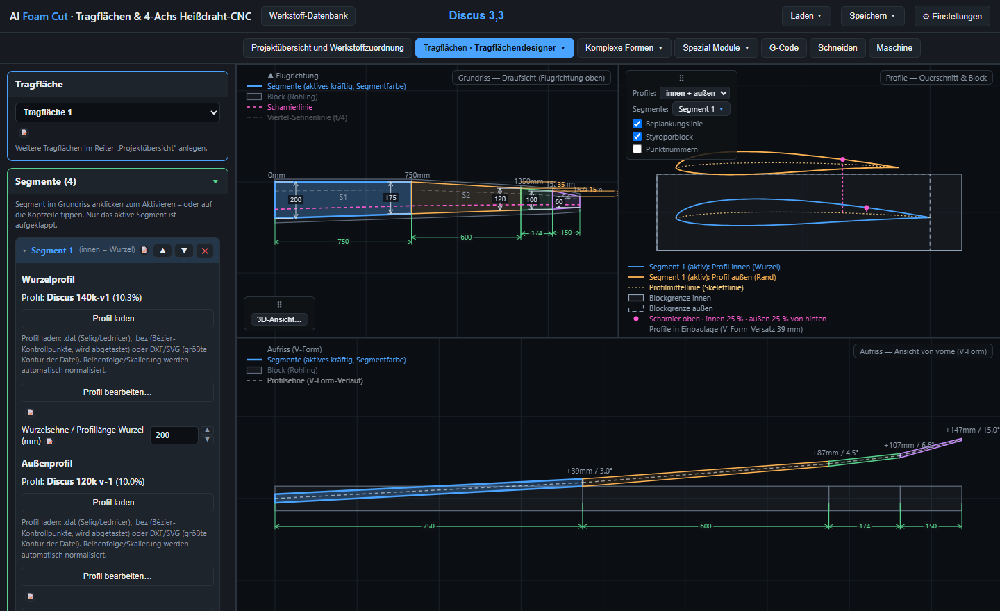

Hier entsteht die Geometrie der Tragfläche. Rechts gibt es drei Fenster:

- **Grundriss** (oben links): Draufsicht mit Flugrichtung nach oben. Jedes Segment hat seine eigene Farbe, dazu Block, Scharnierlinie und Bemaßung. Ein Klick auf ein Segment macht es aktiv.
- **Profile** (oben rechts): Wurzel- und Außenprofil des aktiven Segments im Querschnitt, mit Styroporblock, Skelettlinie und Scharnierpunkt. In der kleinen Schaltbox wählt man *innen + außen / nur innen / nur außen* und kann weitere Segmente zum Vergleich einblenden.
- **Aufriss** (unten): die Ansicht von vorne, hier sieht man die V-Form mit Höhen und Winkeln je Segment.

Über **3D-Ansicht…** lässt sich die ganze Fläche räumlich betrachten.

In der Seitenleiste steht ganz oben immer die **Tragfläche**, die gerade bearbeitet wird. Weitere Tragflächen (Höhenleitwerk usw.) legt man in der Projektübersicht an. Darunter folgen die Gruppen, die ich jetzt einzeln durchgehe.

### 5.1 Segmente

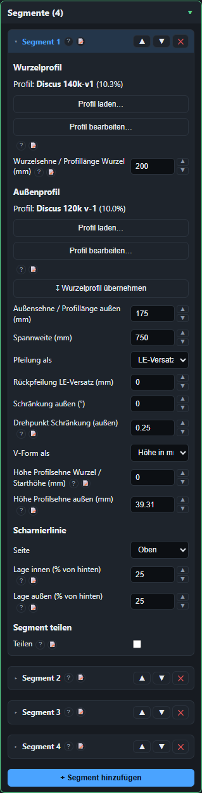

Eine Tragfläche besteht aus beliebig vielen **Segmenten**, jedes ist ein Trapez zwischen zwei Rippen. Je Segment gibt es eine Karte, aufgeklappt ist immer nur das aktive Segment. In der Kopfzeile verschieben **▲/▼** das Segment in der Reihenfolge, **✕** löscht es.

**Wurzelprofil und Außenprofil**

- **Profil laden…** nimmt `.dat` (Selig oder Lednicer), `.bez` (Bézier-Kontrollpunkte), DXF oder SVG (die größte Kontur der Datei). Die Punktreihenfolge und die Skalierung bringt das Programm selbst in Ordnung.
- Das Innenprofil eines Segments ist immer das Außenprofil des vorherigen. Die Stöße zwischen den Segmenten passen dadurch automatisch. Ein Wurzelprofil gibt es deshalb nur bei Segment 1.
- **Profil bearbeiten…** öffnet den Profil-Editor (siehe unten).

**Geometrie**

- **Wurzelsehne / Außensehne** – Profiltiefe innen und außen in mm.
- **Spannweite** – Länge des Segments. Bei V-Form ist das die echte Länge entlang der Fläche, nicht die Projektion.
- **Pfeilung** – als Versatz der Nasenleiste in mm oder als Winkel. Ist die *globale Pfeilung* aktiv, rechnet das Programm den Wert selbst und das Feld ist gesperrt.
- **Schränkung außen** – Verdrehung des Außenprofils in Grad (negativ = Nase nach unten). Der **Drehpunkt** liegt auf der Sehne: 0 = Nasenleiste, 0.25 = t/4, 1 = Endleiste.
- **V-Form** – als Höhe in mm oder als Winkel zum Vorsegment.
- **Höhe Profilsehne Wurzel / Starthöhe** – bei Segment 1 die Lage der ganzen Fläche im Block (0 = Sehnenmitte auf Blockmitte), ab Segment 2 ein zusätzlicher Versatz nur dieser Rippe.

**Scharnierlinie** – Seite (oben oder unten) und Lage in % von hinten, innen und außen getrennt. Die Scharnierlinie dient als Bezug für Holme, Pfeilung und Höhenausrichtung und wird als rosa Linie gezeichnet.

**Segment teilen** – fügt an einer Stelle (in % oder mm von innen) ein interpoliertes Zwischenprofil ein. Sehne, Schränkung, Pfeilung und V-Form werden anteilig aufgeteilt. Praktisch, wenn ein Segment zu lang für die Maschine ist.

**+ Segment hinzufügen** hängt ein neues Segment außen an.

 

### 5.2 Der Profil-Editor

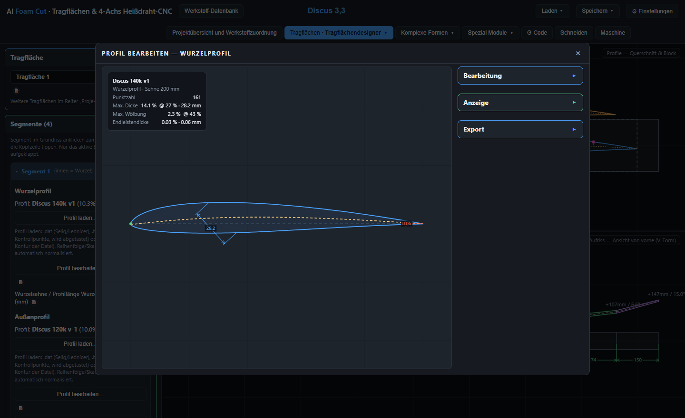

Links die Kontur mit Skelettlinie, Sehne und Maßen, oben links eine Infobox mit Punktzahl, maximaler Dicke und Wölbung samt Lage sowie der Endleistendicke. Rechts drei Gruppen:

- **Bearbeitung** – **Punktzahl** (die Kontur wird mit einem Spline neu abgetastet und an Nase und Endleiste verdichtet, dadurch bekommen auch grob aufgelöste Profile eine runde Nase), **max. Profildicke** und **max. Wölbung** in % (skalieren die Dicken- bzw. Wölbungsverteilung), **Endleistendicke** in mm und **Zurücksetzen**.
- **Anzeige** – Skelettlinie, Sehnenlinie, Punkte, Dicken- und Wölbungsmaße.
- **Export** – das bearbeitete Profil als `.dat` oder DXF speichern.

### 5.3 Beplankung

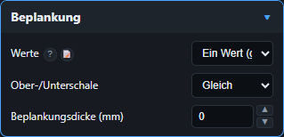

Wer seinen Kern beplankt (Balsa, Furnier, GFK), zieht hier die **Schalendicke** von der Profilkontur ab. Der Kern wird dann um genau diese Dicke kleiner geschnitten, sodass die fertige Fläche wieder das Sollprofil hat.

- **Werte** – *ein Wert für die ganze Fläche* oder *segmentweise*. Dann steht die Dicke in jeder Segmentkarte.
- **Ober-/Unterschale** – *gleich* oder *asymmetrisch* mit getrennter Dicke oben und unten.

An der dünnen Endleiste würden sich die nach innen versetzten Linien überschneiden (der „Fischschwanz“). Das Programm erkennt das, führt die Kontur am Schnittpunkt zusammen und hält trotzdem Wurzel und Rand punktgenau synchron.

 

### 5.4 Profilhöhenausrichtung

Normalerweise liegt jedes Profil mit seiner Sehne auf der V-Form-Linie. Mit **Profile global ausrichten** richtet man stattdessen alle Profile an einem gemeinsamen Merkmal aus:

- **Ausrichten an** – *höchstem Punkt*, *Profilsehne*, *unterstem Punkt* oder *Scharnierlinie*. Mit „unterstem Punkt“ bekommt man z. B. eine gerade Unterseite, auf der die Fläche flach aufliegt.
- **Gruppengrenzen** – ab welchem Segment ein Knick in der V-Linie beginnt. Ohne Grenze läuft sie als eine Gerade über die ganze Spannweite.
- Je Gruppe die **V-Form** als Höhe am Randbogen oder als Winkel.

Die V-Form der einzelnen Segmente wird dann nicht mehr verwendet.

**Fläche kippen** (eigene Gruppe darunter) dreht die gesamte Tragfläche um die Wurzelrippe nach oben oder unten. Die Knicke zwischen den Segmenten bleiben gleich, der Winkel kommt einfach obendrauf.

 

### 5.5 Globale Pfeilung

Das Gegenstück in der Draufsicht: Eine Bezugslinie wird über mehrere Segmente zu einer Geraden gemacht, und das Programm rechnet die Versätze je Segment selbst aus.

- **Ausrichten an** – *Scharnierlinie*, *Nasenleiste* oder *Endleiste*. Bei der Scharnierlinie bekommt man eine durchgehend gerade Ruderachse, auch wenn sich die Profiltiefe ändert.
- **Gruppengrenzen** – wo die Bezugslinie einen Knick bekommt.
- Je Gruppe die **Pfeilung** als Winkel oder x-Versatz.

 

### 5.6 Holmausschnitte

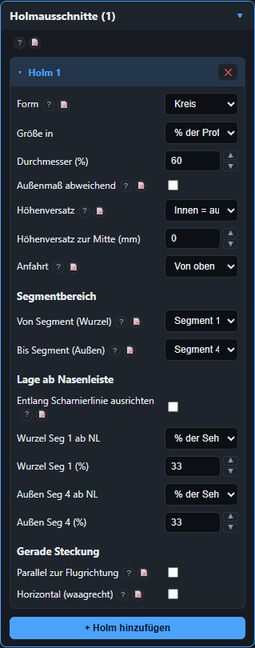

Holmtaschen werden unabhängig von den Segmenten angelegt. Jeder Holm läuft als gerade Linie von der Wurzel seines Von-Segments bis zum Außenprofil seines Bis-Segments, dazwischenliegende Segmente werden gerade durchzogen. **+ Holm hinzufügen** legt einen neuen an, ein Klick im Grundriss macht einen Holm aktiv.

- **Form** – *Kreis*, *Oval*, *Trapez*, *Doppel-T*, *Tasche (Gurt ohne Steg)*, *Tasche + Steg* oder *Scharnierschnitt* (V- oder trapezförmige Kerbe mit der Spitze auf der Scharnierlinie).
- **Größe in** – % der Profilhöhe oder mm. Mit **Außenmaß abweichend** läuft der Holm konisch.
- **Höhenversatz** – Lage gegenüber der Skelettlinie, innen und außen gleich oder getrennt.
- **Anfahrt** – wie der Draht in die Tasche einsticht: *kürzester Weg*, *von oben* oder *von unten*.
- **Segmentbereich** – von welchem bis zu welchem Segment.
- **Lage ab Nasenleiste** – in % der Sehne oder mm, an Wurzel und außen. **Entlang Scharnierlinie ausrichten** setzt den Holm direkt vor das Scharnier.
- **Gerade Steckung** – *parallel zur Flugrichtung* ignoriert die Pfeilung, *horizontal* ignoriert die V-Form. Das braucht man für Steckungsrohre.

Beim Doppel-T und bei den Gurttaschen gibt es zusätzlich Breite und Höhe für Ober-, Untergurt und Steg. Ist ein Gurt dünner als der Abbrand, verdickt das Programm ihn automatisch und warnt.

 

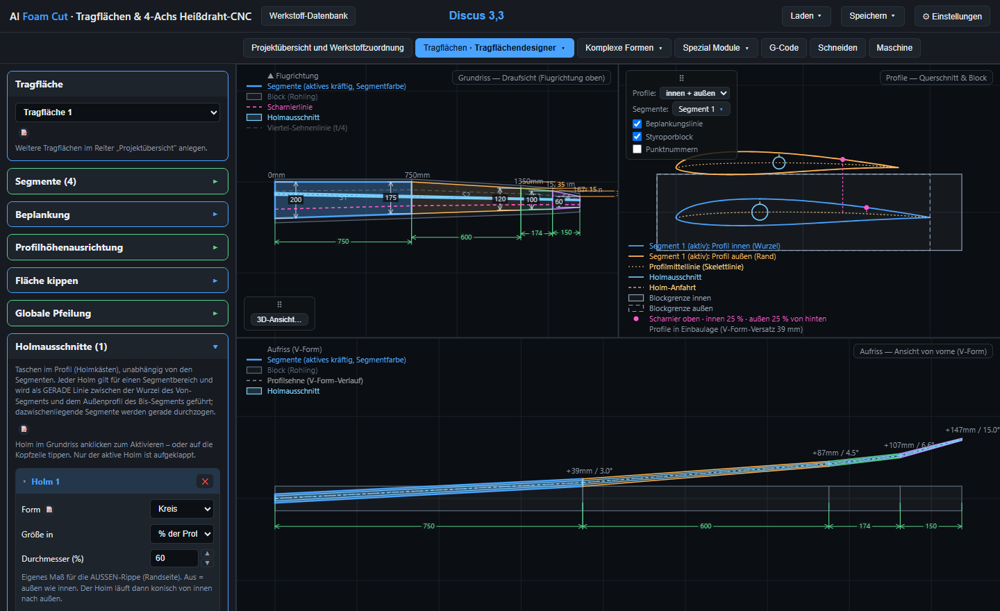

Im Bild sieht man den Holm als hellblaues Band im Grundriss und als Kreis in beiden Profilen, dazu die gestrichelte Anfahrt des Drahts.

### 5.7 Anzeige

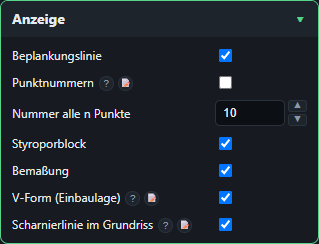

Hier schaltet man ein und aus, was gezeichnet wird: **Beplankungslinie**, **Schnittspur (Abbrand)**, **Abbrand-Verteilung farbig**, **Punktnummern**, **Styroporblock**, **Bemaßung**, **V-Form (Einbaulage)** und die **Scharnierlinie im Grundriss**. Das ist reine Darstellung und ändert am Schnitt nichts.

 

---

## 6. Das Kerndesign

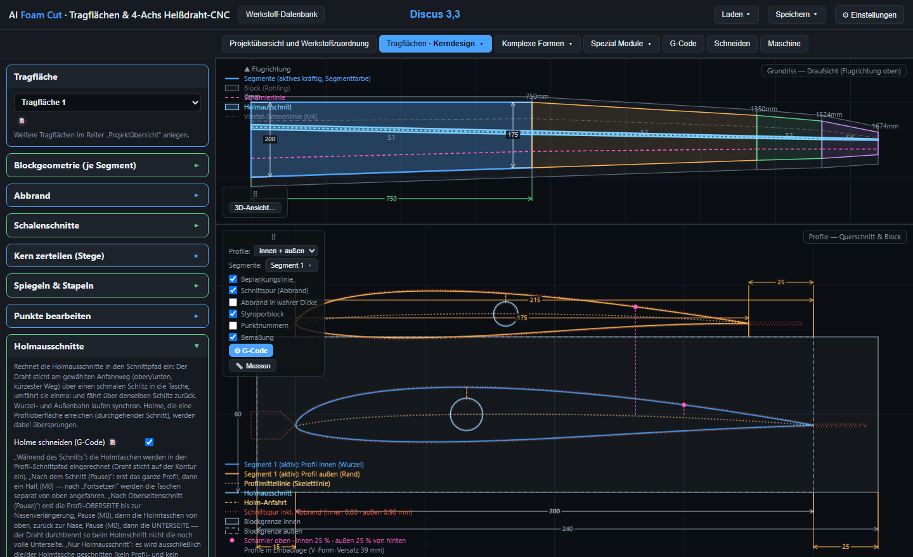

Im Kerndesign wird aus der Tragfläche der **Schaumkern** abgeleitet, also das, was der Draht tatsächlich schneidet. Oben der Grundriss mit dem Block je Segment, unten der Querschnitt mit Beplankungslinie, **Schnittspur** (rot punktiert), Schnittverlängerungen und Bemaßung. In der Schaltbox kann man zusätzlich den **Abbrand in wahrer Dicke** einblenden: dann sieht man als halbtransparentes Band, wie breit der Draht wirklich schneidet.

Mit **⚙ G-Code** (oder **Strg+G**) springt man direkt in den G-Code-Reiter, **Messen** misst Abstände in der Zeichnung.

### 6.1 Blockgeometrie (je Segment)

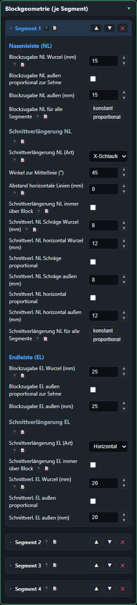

Pro Segment eine Karte, getrennt für **Nasenleiste** und **Endleiste**. Es gibt jeweils zwei Größen:

- **Blockzugabe** – wie viel Schaum vor der Nase bzw. hinter der Endleiste im Block stehen bleibt. Außen auf Wunsch **proportional zur Sehne**.
- **Schnittverlängerung** – wie weit der Draht über das Profil hinaus fährt, damit er sauber ein- und ausfährt. Sie darf auch über den Block hinausragen.

Die **Art der Verlängerung** an der Nase:

- *X-Schlaufe* – der Draht fährt schräg nach vorne unten, parallel vor, senkrecht hoch und gespiegelt zurück. Einstellbar sind **Winkel zur Mittellinie** (Standard 45°), **Abstand der horizontalen Linien** sowie Länge der Schräge und der Waagrechten, innen und außen.
- *Liegende Acht* – eine ∞-Schlaufe, die tangential in Ober- und Unterseite übergeht.
- *Horizontal nach vorne* oder *keine*.

An der Endleiste läuft die Verlängerung *horizontal* (empfohlen), *entlang der Skelettlinie*, *tangential* oder parallel zur Ober- bzw. Unterseite. Mit **immer über Block** wird die Verlängerung so weit angehoben, dass sie den Blocküberstand sicher überragt.

Mit **für alle Segmente: konstant / proportional** überträgt man die Werte des aktiven Segments auf alle anderen. Ab Segment 2 wird der Wurzelwert automatisch vom Vorsegment übernommen.

 

### 6.2 Abbrand

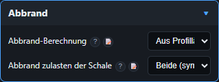

- **Abbrand-Berechnung** – *aus Profillängen-Verhältnis*: je Rippe ein Wert aus dem Verhältnis der Profillängen (die kürzere Rippe läuft langsamer und brennt breiter). *Aus Bahngeschwindigkeit*: je Schnittsegment aus der tatsächlichen lokalen Geschwindigkeit. Das ist genauer bei verwundenen oder stark unterschiedlichen Konturen.
- **Abbrand zulasten der Schale** – *beide (symmetrisch)*, *Oberschale exakt* oder *Unterschale exakt*. Der Kern selbst bleibt immer auf Nennmaß, der Verlust geht nur zulasten der abfallenden Schalen. Wer die Oberschale als Formschale weiterverwendet, stellt „Oberschale exakt“ ein.

Die V-Form ist immer in den Schnitt eingerechnet: Der Block liegt waagrecht, das Werkstück wird schräg herausgeschnitten.

 

### 6.3 Schalenschnitte

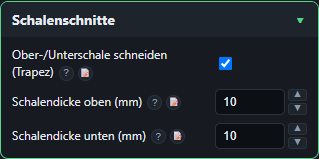

**Ober-/Unterschale schneiden (Trapez)** – zwei zusätzliche waagrechte Trennschnitte: die Oberschale vor und die Unterschale nach dem Kernschnitt. Sie laufen als leichtes Trapez, um den höheren Abbrand an der Außenrippe auszugleichen. **Schalendicke oben / unten** zählt ab Blockober- bzw. -unterkante. Der Block muss dann beide Schalen und den Kern fassen.

 

### 6.4 Kern zerteilen (Stege)

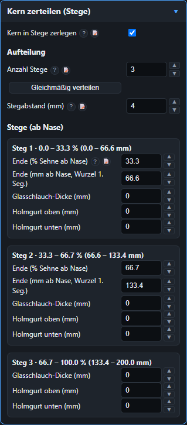

Mit **Kern in Stege zerlegen** wird der Kern in Sehnenrichtung in einzelne Stücke geteilt, z. B. um dazwischen Holmgurte oder Glasschlauch einzulegen.

- **Anzahl Stege** und **Gleichmäßig verteilen**.
- **Stegabstand** – um diesen Betrag werden die Stege im Block auseinandergerückt, damit sie getrennt geschnitten werden können.
- Je Steg das **Ende** in % der Sehne oder mm ab der Nase, dazu **Glasschlauch-Dicke** und **Holmgurt oben / unten**. Diese Dicken werden von der Kontur des Stegs abgezogen.

Jeder Steg wird für sich auf Nennmaß kompensiert. Geschnitten werden nur die Stege, der Block rundherum ist Verschnitt.

 

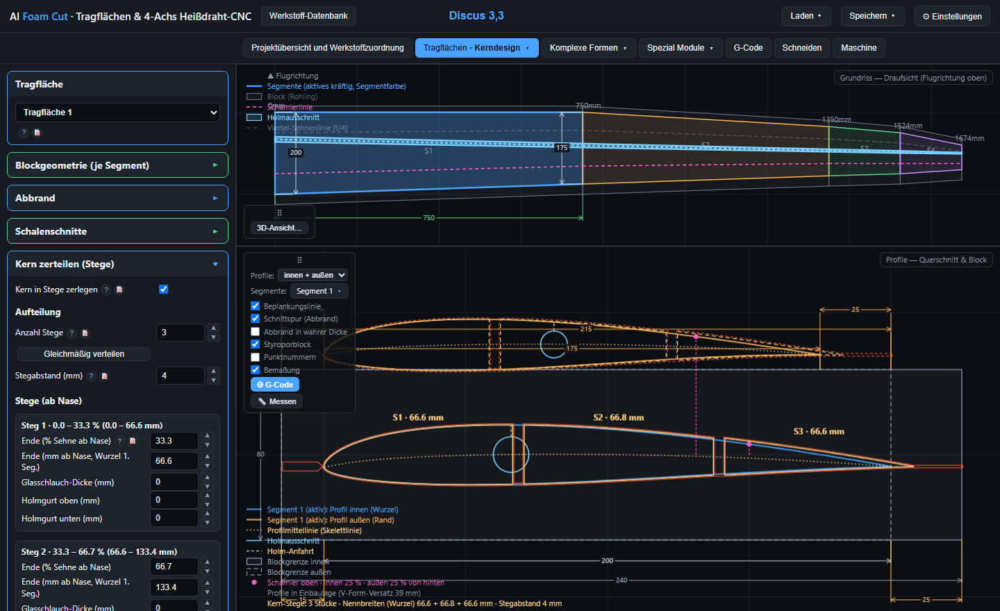

### 6.5 Spiegeln & Stapeln

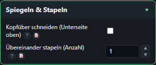

- **Kopfüber schneiden** – spiegelt das Werkstück, aus V wird Λ.
- **Übereinander stapeln** – mehrere Kerne übereinander in einem durchgehenden Drahtweg. Den Block dann entsprechend höher machen.
- **Stapelabstand**, **Stapel vertikal verschieben** und **abwechselnd spiegeln** (jede zweite Kopie gespiegelt, praktisch für Links-Rechts-Paare).

 

### 6.6 Punkte bearbeiten

Wenn einmal eine Stelle nicht passt, kann man von Hand nacharbeiten. **Bearbeiten aktiv** zeigt die Stützpunkte des aktiven Segments als Griffe, Wurzel blau und Rand orange.

- **Ziel** *Profil*: die Kontur wird verändert und danach neu abgetastet. **Ziel** *Schneidepfad*: der fertige Drahtweg mit Abbrand wird eingefroren und direkt bearbeitet.
- Griff ziehen = verschieben, Doppelklick auf eine Kante = Punkt einfügen, Rechtsklick = Punkt löschen, Strg+Z / Strg+Y = rückgängig / wiederholen.
- **Schneidepfad zurücksetzen** holt den Pfad wieder frisch aus dem Profil.

 

### 6.7 Holmausschnitte

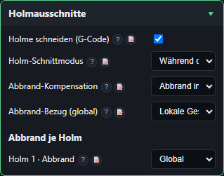

Form und Lage der Holme kommen aus dem Tragflächendesigner. Hier wird festgelegt, **ob und wie** sie geschnitten werden:

- **Holme schneiden** – der Draht sticht über einen schmalen Schlitz in die Tasche, umfährt sie und fährt über denselben Schlitz zurück.
- **Holm-Schnittmodus** – *während des Schnitts*, *nach dem Schnitt (Pause)*, *nach dem Oberseitenschnitt (Pause)* oder *nur Holmausschnitt*.
- **Abbrand-Kompensation** – *ohne*, *innen* (fertige Tasche = Nennmaß, Standard) oder *außen*. Auch je Holm einzeln einstellbar.

 

### 6.8 Werkstück drehen (Pfeilung)

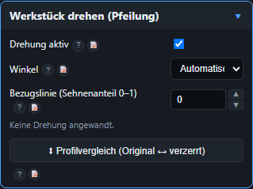

Ein stark gepfeiltes Segment braucht viel Fahrweg in X. Mit **Drehung aktiv** wird das Werkstück um die Hochachse gedreht, bis eine Bezugslinie parallel zum Draht liegt. Der Winkel kommt *automatisch aus der Bezugslinie* (Anteil der Sehne 0–1) oder wird *fest* vorgegeben. Der Rohblock wird im Grundriss und in der Simulation gedreht gezeichnet. Beim Aufspannen den Block dann real um den angezeigten Winkel drehen.

 

---

## 7. Das Negativschalendesign

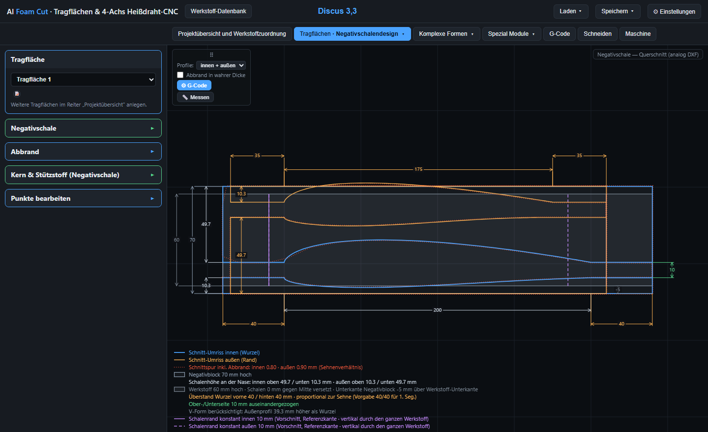

Statt eines Kerns kann man auch die **Negativform** schneiden, also die beiden Formhälften, in die später laminiert wird. Die Negativschale nutzt dieselben Profile, Sehnen und V-Form wie die Tragfläche. Welche Tragfläche als Negativ entsteht, stellt man in der Projektübersicht unter *Design* ein.

Im Bild sieht man die beiden Schalen auseinandergezogen, darunter in der Legende alle wichtigen Werte: Blockhöhe, Schalenhöhe an der Nase, Überstände, V-Form-Versatz und den konstanten Schalenrand.

### 7.1 Negativschale

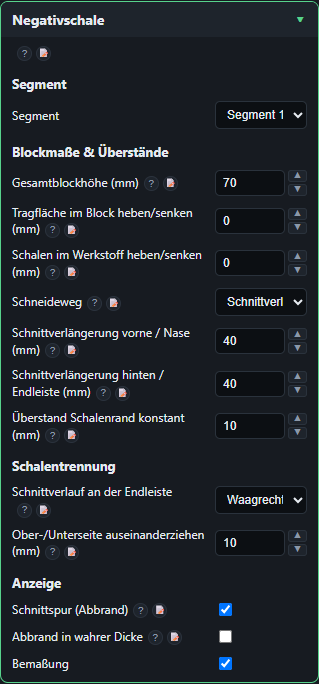

- **Segment** – welches Segment gezeigt und geschnitten wird.
- **Formblockhöhe** – Höhe des Negativblocks (Formblock).
- **Tragfläche im Block heben/senken** und **Schalen im Werkstoff heben/senken** – verschiebt die Profillage bzw. beide Schalen gegenüber dem Werkstoff.
- **Schneideweg** – *mit Schnittverlängerung* (klassisch mit Vorschnitten) oder *ein Zug*: der Draht fährt mit konstantem Überstand an der Blockkante entlang, ohne Vorschnitte und Freifahren.
- **Schnittverlängerung vorne / hinten** – Überstand vor der Nase und hinter der Endleiste, proportional zur Sehne.
- **Überstand Schalenrand konstant** – der gleichbleibende Rand um das Profil (violett gezeichnet), der als Referenzkante dient.
- **Schalentrennung** – wie der Schnitt an der Endleiste verläuft und um wie viel **Ober- und Unterseite auseinandergezogen** werden.
- **Anzeige** – Schnittspur, Abbrand in wahrer Dicke, Bemaßung.

 

### 7.2 Abbrand

Wie im Kerndesign: Berechnung aus dem Profillängen-Verhältnis oder aus der Bahngeschwindigkeit. Bei der Negativschale geht der Abbrand natürlich nach außen in den Werkstoff, damit die Form das Nennmaß hat.

 

### 7.3 Kern & Stützstoff

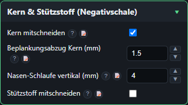

- **Kern mitschneiden** – der Kern entsteht im selben Durchgang aus dem Inneren der Form. Mit **Beplankungsabzug Kern** wird er um die Laminatdicke kleiner, **Nasen-Schlaufe vertikal** legt die Höhe der Schlaufe an der Nase fest.
- **Stützstoff mitschneiden** – zusätzlich die Stützteile, die die Schalen beim Laminieren tragen.
- **Kern in Stege zerlegen** – wie im Kerndesign (Abschnitt 6.4).

 

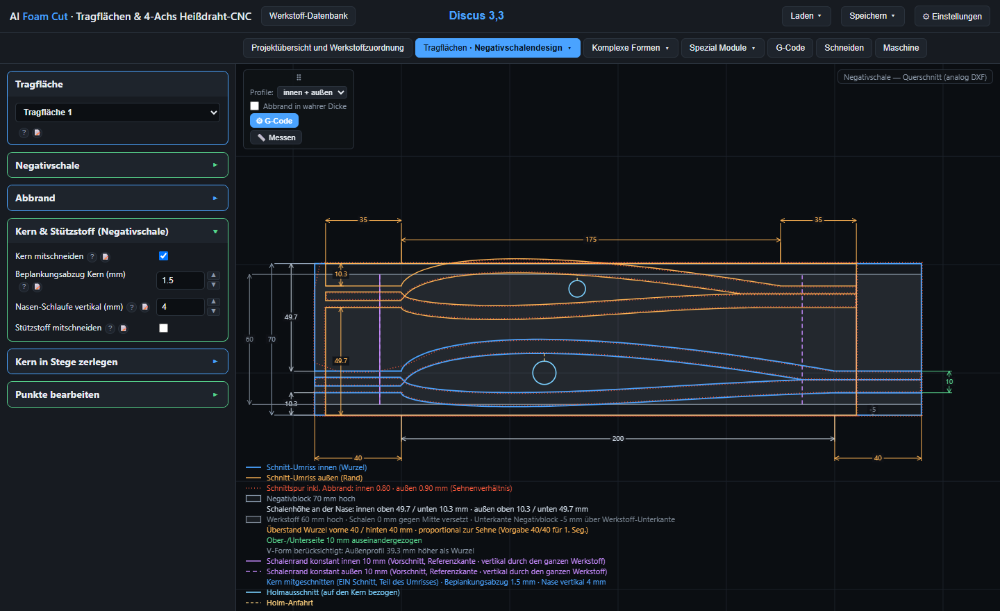

### 7.4 Punkte bearbeiten

Wie im Kerndesign (Abschnitt 6.6): Stützpunkte der Kontur oder direkt des Schneidepfads mit der Maus verschieben, einfügen oder löschen.

 

---

## 8. DXF-Formen – komplexe Formen wie Rümpfe

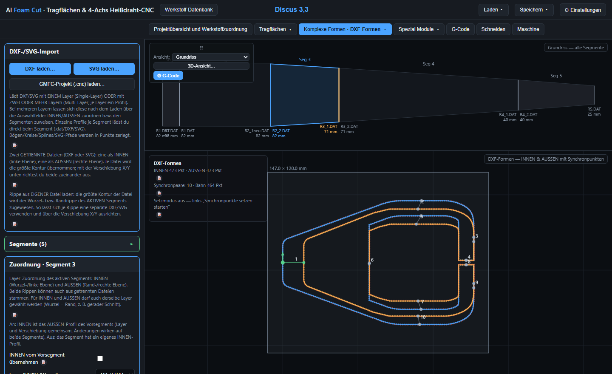

Nicht alles ist eine Tragfläche. Für **beliebige Konturen** gibt es das Modul *DXF-Formen*. Hier bekommt jeder Turm seine eigene Kontur: **INNEN** (linker Turm, Wurzel) und **AUSSEN** (rechter Turm, Rand). Sind beide gleich, entsteht ein gerader Körper, sind sie verschieden, ein verjüngter.

Im Bild ist das GMFC-Projekt **„Rumpf V2“** geladen (*GMFC-Projekt (.cnc) laden…*). Der Rumpf besteht aus fünf Segmenten mit den Spanten R1 bis R5. Oben sieht man den Grundriss aller Segmente mit den Spantnamen und -breiten, das aktive Segment 3 ist blau hervorgehoben. Unten steht der Querschnitt dieses Segments: außen die Rumpfkontur, innen die Aussparung, in Blau die Wurzelrippe (INNEN, Spant R3_1) und in Orange die Randrippe (AUSSEN, R3_2), dazu die nummerierten Synchronpunkte, die beide Rippen miteinander verknüpfen. Konturen, Segmente und Synchronpunkte werden beim Import komplett aus GMFC übernommen.

- **DXF-/SVG-Import** – eine Datei mit einem Layer (dann INNEN = AUSSEN), mit mehreren Layern (je Layer ein Profil) oder zwei getrennte Dateien für INNEN und AUSSEN.
- **Segmente** – wie bei der Tragfläche kann eine Form aus mehreren Segmenten bestehen, jedes mit zwei eigenen Profilen.
- **Zuordnung** – welcher Layer INNEN und welcher AUSSEN ist. Einzelne Rippen kann man auch aus einer eigenen Datei laden.
- **Blockgeometrie** – Blockgröße und Lage der Kontur im Block.
- **Synchronpunkte** – das Wichtigste bei ungleichen Konturen. Die nummerierten Punkte legen fest, welche Stelle innen zu welcher Stelle außen gehört, damit der Draht nicht verdreht. Mit *Synchronpunkte setzen* klickt man Paare an, das Programm verteilt die Punkte dazwischen gleichmäßig.
- **Schnitt** – Startpunkt, Schnittrichtung, Abbrand, Ein- und Ausfahrt.
- **Punkte bearbeiten**, **CAD-Bearbeitung** (Kontur im CAD-Editor nacharbeiten) und **Hintergrundbild** (z. B. eine eingescannte Zeichnung zum Abzeichnen).

---

## 9. 3D-Modell – vom STL zur Styroporscheibe

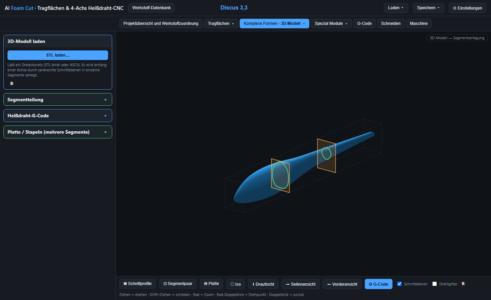

Mit dem Modul *3D-Modell* lässt sich ein beliebiges **STL-Modell** in Scheiben zerlegen, die dann einzeln mit dem Draht geschnitten und später wieder zusammengeklebt werden. Im Bild ist der Rumpf einer **Hornet H-206** geladen und mit zwei Schnittebenen in drei Segmente geteilt.

- **3D-Modell laden** – STL binär oder ASCII.
- **Segmentteilung** – die Achse wählen und Schnittebenen setzen, entweder gleichmäßig oder von Hand an bestimmten Stellen. Jede Ebene lässt sich nachträglich verschieben.

Unten in der Zeichenfläche wechselt man zwischen den Ansichten.

### 9.1 Schnittprofile

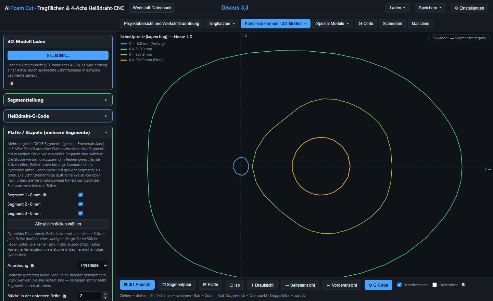

Alle Schnittebenen lagerichtig übereinandergelegt, jede in einer eigenen Farbe und mit ihrer Position beschriftet. So sieht man auf einen Blick, wie stark sich der Querschnitt von Scheibe zu Scheibe ändert.

### 9.2 Segmentpaar und Schneidepfade

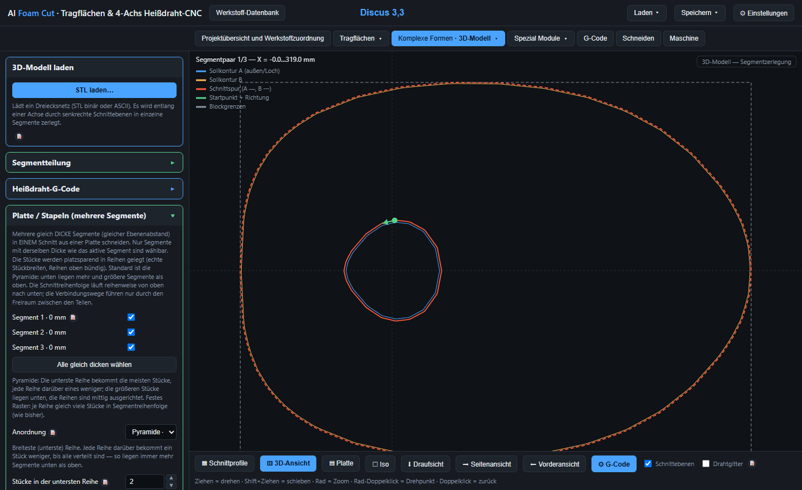

Das ist die Ansicht, aus der der G-Code entsteht: die beiden Endquerschnitte eines Segments (Sollkontur A und B) und darüber die **Schnittspur** mit Abbrand, die der Draht tatsächlich fährt. Der grüne Punkt mit Pfeil zeigt Startpunkt und Richtung, gestrichelt sind die Blockgrenzen. A und B liegen index-synchron übereinander, damit der Draht nicht verdreht.

In der Gruppe **Heißdraht-G-Code** stellt man dazu Anfahrwinkel, Startpunkt, Abbrand und Vorschub ein.

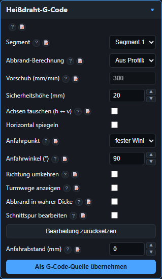

### 9.3 Platte und Stapeln

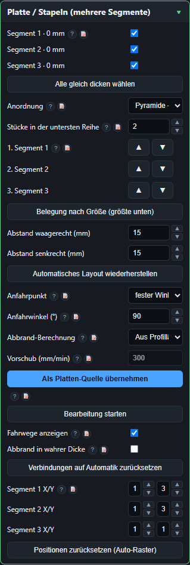

Mehrere gleich **dicke** Segmente lassen sich in einem einzigen Schnitt aus einer Platte herausschneiden. In der Gruppe *Platte / Stapeln* hakt man die Segmente an (oder nimmt **Alle gleich dicken wählen**) und legt die Anordnung fest:

- **Anordnung** – *Pyramide* (die unterste Reihe bekommt die meisten Stücke, jede Reihe darüber eines weniger, die größeren Stücke liegen unten) oder *festes Raster*.
- **Stücke in der untersten Reihe**, **Abstand waagerecht und senkrecht**.
- **Automatisches Layout wiederherstellen**, wenn man Teile von Hand verschoben hat.

 

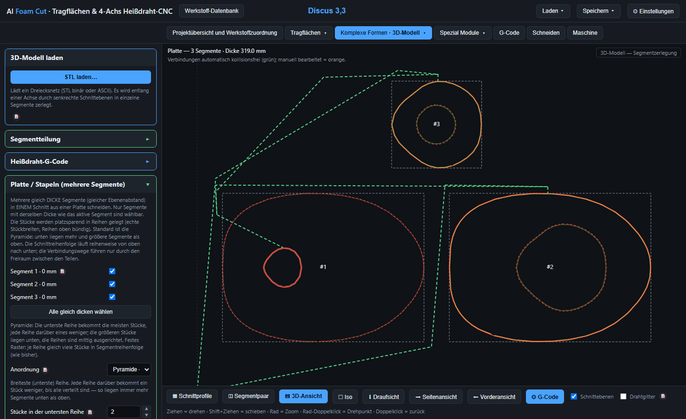

Die Stücke werden platzsparend verteilt, und das Programm legt die **Verbindungswege** zwischen ihnen automatisch kollisionsfrei durch den Freiraum (grün gestrichelt). Von Hand geänderte Wege werden orange dargestellt. Die Schnittreihenfolge läuft reihenweise von oben nach unten, die Nummern (#1, #2, #3) zeigen sie an.

Die einzelnen Segmente lassen sich auch als STL exportieren, etwa um sie zusätzlich zu drucken.

---

## 10. Schriften

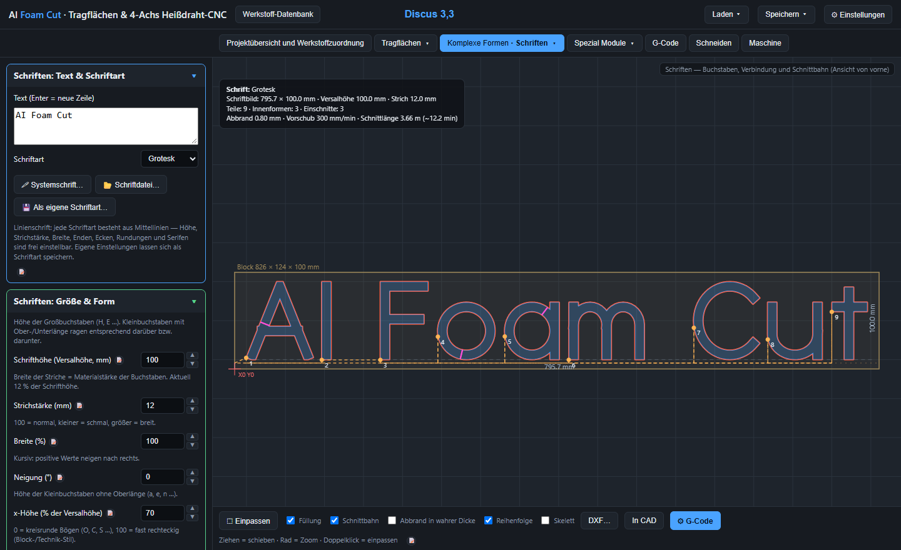

Für Buchstaben und Schriftzüge aus Schaum gibt es ein eigenes Modul. Man tippt den Text ein, wählt eine Schriftart und stellt Höhe, Strichstärke, Breite und Neigung ein. Neben den eingebauten Linienschriften lassen sich auch **Systemschriften** und **TTF/OTF-Dateien** verwenden.

Das Programm verbindet die Buchstaben automatisch zu einem durchgehenden Schnitt, schneidet Innenformen (wie beim O oder A) über kurze Einschnitte frei und nummeriert die Reihenfolge. Die Infobox oben links zeigt Schriftbild, Blockgröße, Schnittlänge und die voraussichtliche Schnittzeit. Mit **In CAD** geht der Schriftzug in den CAD-Editor, mit **DXF…** in eine Datei, mit **⚙ G-Code** direkt an die Maschine.

---

## 11. Die Spezialmodule

Unter *Spezial Module* sind die Werkzeuge zusammengefasst, die über das reine Styroporschneiden hinausgehen.

### 11.1 Rippendesigner

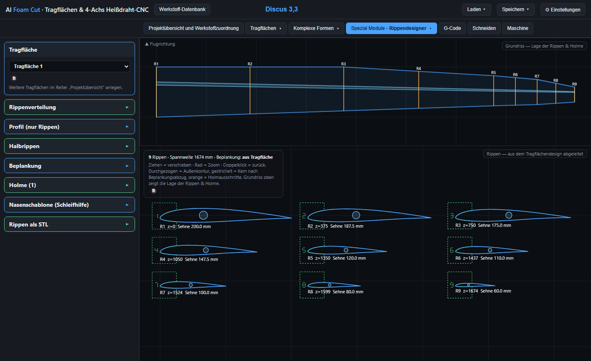

Für Leute, die klassisch in Rippenbauweise bauen: Aus der Tragfläche werden **Rippen** abgeleitet, mit Rippenverteilung, Halbrippen, Beplankungsabzug und Holmausschnitten. Dazu kommen **Nasenschablonen** als Schleifhilfe. Ausgabe als STL (für den 3D-Drucker) oder über den CAD-Editor als DXF (z. B. für den Laser).

### 11.2 CAD-Bearbeitung

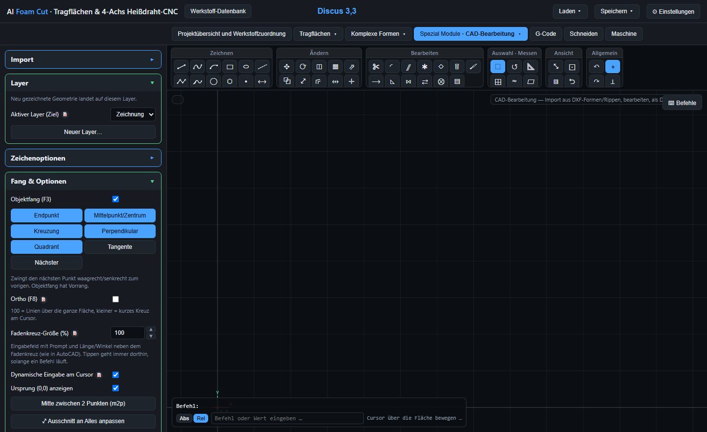

Ein eigener **2D-CAD-Editor** mit Layern, Objektfang und einer Befehlszeile, die wie AutoCAD arbeitet: Kürzel tippen (`l` Linie, `ci` Kreis, `o` Versetzen, `tr` Trimmen …), Enter, fertig. Koordinaten gehen absolut, relativ (`@dx,dy`) oder polar (`Länge<Winkel`).

Man kann Konturen aus allen Designs importieren (Tragfläche, Kern, Negativ, Rippen, 3D-Modell, DXF-Formen), nacharbeiten und als DXF exportieren oder an die DXF-Formen zurückgeben. Die Liste aller Befehle öffnet der Knopf **⌨ Befehle**.

### 11.3 Formenbau

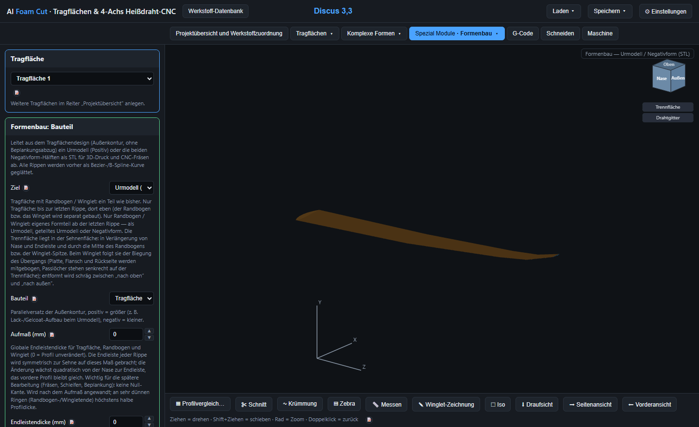

Hier wird aus der Tragfläche ein **Urmodell** (Positiv) oder direkt die **Negativform** als STL für den 3D-Druck erzeugt. Die Rippen werden dafür als glatte B-Spline-Fläche verbunden. Oben in der Gruppe *Bauteil* wählt man:

- **Ziel** – *Urmodell (Positiv)*, *Urmodell geteilt* (obere und untere Hälfte, abformbar) oder *Negativform* (obere und untere Formhälfte).
- **Bauteil** – *Tragfläche mit Randbogen / Winglet* (ein Teil), *nur Tragfläche* (bis zur letzten Rippe) oder *nur Randbogen / Winglet* als eigenes Formteil.
- **Aufmaß** (z. B. für Lack oder Gelcoat) und **Endleistendicke**.

Dazu gibt es eine Trennfläche für die Formhälften, Pass- und Steckungsbohrungen, die Aufteilung in druckbare Stücke, eine Krümmungs- und Zebra-Analyse, den Profilvergleich (Rohpunkte gegen geglättete Kurve) und einen STEP-Export für CAD-Programme.

#### Randbögen

Das Außenende der Tragfläche wird in der Gruppe **Randbogen / Wingtip** gestaltet. Unter **Form** gibt es *Randbogen (parametrisch)*, *flach* (ebener Deckel), *Winglet* und *Winglet aus Zeichnung*.

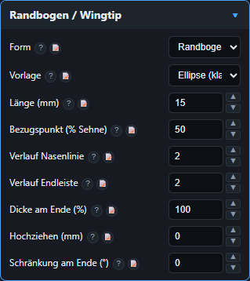

Beim Randbogen laufen Nasen- und Endleistenlinie als Superellipsen zu einem gemeinsamen Punkt zusammen. Das klingt kompliziert, ist aber einfach zu bedienen, weil es **Vorlagen nach echten Segelflugzeugen** gibt. Nach der Wahl einer Vorlage sind alle Werte frei änderbar:

- **Länge** – wie weit der Randbogen über die letzte Rippe hinausragt.
- **Bezugspunkt (% Sehne)** – wo Nasen- und Endleistenlinie zusammenlaufen: 0 = an der Nase, 100 = an der Endleiste (die Endleiste läuft dann gerade weiter und nur die Nase pfeilt zurück).
- **Verlauf Nasenlinie / Endleiste** – der Exponent der Superellipse: 1 = gerade Linie, 2 = Viertelellipse, 3 bis 8 = läuft lange gerade weiter und rundet erst kurz vor dem Ende ein.
- **Dicke am Ende** – relative Profildicke an der Spitze. Hochgezogene Randbögen laufen meist dünner aus.
- **Hochziehen** – hebt das Ende zusätzlich an, mit tangentialem Beginn.
- **Schränkung am Ende** – verdreht nur den Randbogen.

 

Die vier Vorlagen in der Draufsicht (Bauteil „nur Randbogen“):

| | |
|---|---|
| 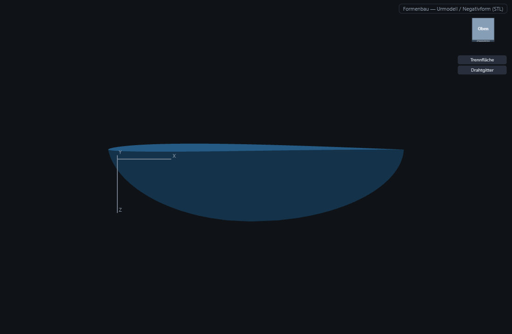 |  |
| **Ellipse** – klassisch, wie bei LS4 oder ASW 19 | **Sichel** – Endleiste läuft weiter, Nase zieht zurück (Discus, ASW 27, Ventus) |
|  |  |
| **Gerade gepfeilt** – Spitze an der Endleiste | **Hochgezogen** – dünner auslaufend (DG, LS) |

#### Winglets

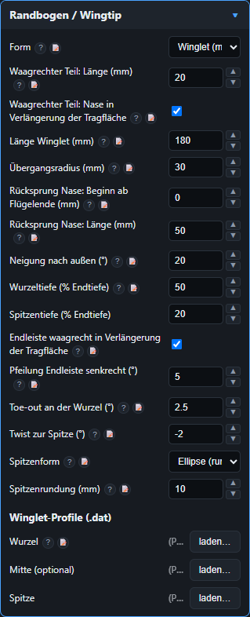

Mit **Form: Winglet** biegt die Fläche über einen Übergangsbogen tangential in ein aufgestelltes Winglet. Die Vorgaben orientieren sich an modernen Segelflugzeugen (Maughmer-Winglets wie bei Discus 2, ASW 28 oder LS8). Winglets gibt es beim Urmodell und als eigenes Formteil (Bauteil „nur Randbogen / Winglet“). Bei Formhälften der ganzen Tragfläche wären sie hinterschnitten.

- **Waagrechter Teil: Länge** – verlängert die Fläche vor dem Bogen noch waagrecht.
- **Länge Winglet** – entlang der Mittellinie, inklusive Bogen und Spitze.
- **Übergangsradius** – Radius des Bogens. Das Programm hält ihn mindestens beim 1,5-fachen der Profilhöhe.
- **Rücksprung Nase** – ab wo und auf welcher Länge die Nase von der Flügel-Endtiefe auf die Winglet-Wurzeltiefe zurückspringt. Die Endleiste läuft dabei weiter.
- **Neigung nach außen** – aus der Senkrechten, typisch 15 bis 25°.
- **Wurzeltiefe / Spitzentiefe** – in % der Flügel-Endtiefe, typisch 50–60 % bzw. etwa 25 %.
- **Pfeilung der Endleiste** waagrecht und senkrecht.
- **Toe-out** (typisch 2–3°) und **Twist zur Spitze** (typisch −2°).
- **Spitzenform** – Ellipse, Sichel oder frei.
- **Winglet-Profile (.dat)** – eigene Profile für Wurzel, Spitze und optional die Mitte. Ohne eigenes Profil wird das Profil der Flügel-Endrippe weiterverwendet.

Alle Übergänge sind stetig ohne Knicke, und das Ergebnis wird auf Wasserdichtheit geprüft, damit das STL sauber druckbar ist.

 

| | |
|---|---|
| 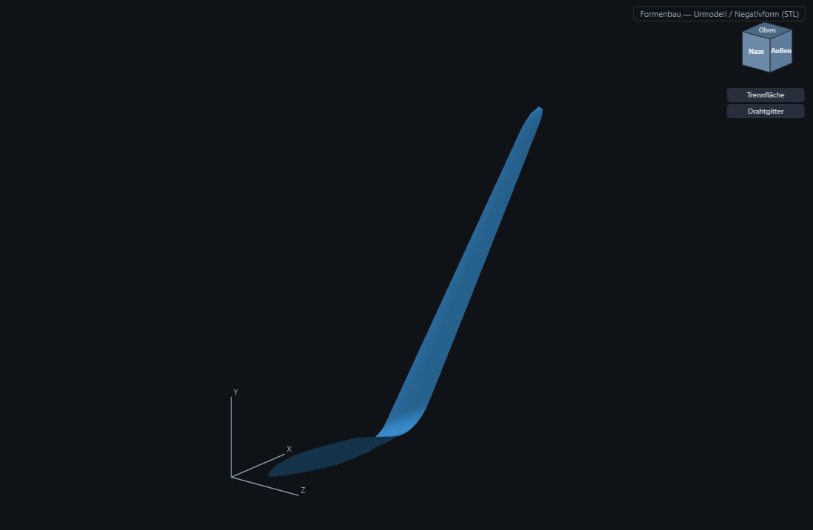 | 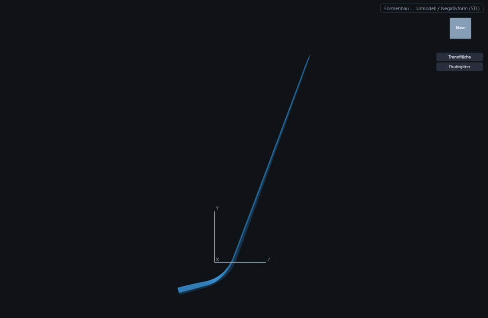 |
| Winglet, Iso-Ansicht | Winglet von vorne: Übergangsbogen und Neigung |

#### Negativform: untere Hälfte mit Wurzelverlängerung

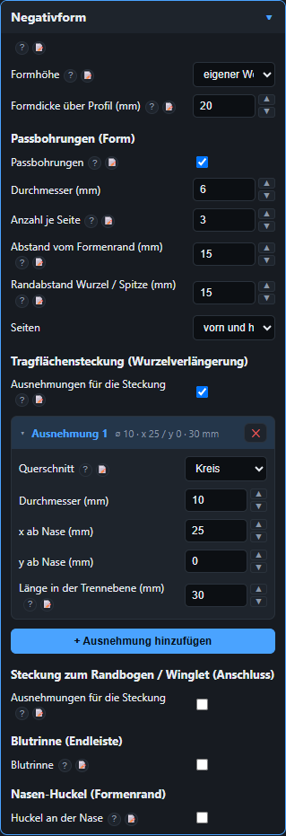

Mit **Ziel: Negativform** entstehen die beiden Formhälften. Über die Knöpfe rechts in der Zeichenfläche zeigt man *beide Hälften*, *nur obere Form* oder *nur untere Form* und blendet die Trennfläche ein.

In der Gruppe **Negativform** stehen die Werte der Form selbst:

- **Formhöhe** – eigener Wert (Formdicke über dem Profil) oder passend zu den Negativschalen aus dem Negativdesign.
- **Passbohrungen (Form)** – Löcher im Flansch, mit denen die beiden Formhälften beim Laminieren zueinander ausgerichtet werden: **Durchmesser**, **Anzahl je Seite**, **Abstand vom Formenrand**, **Randabstand an Wurzel und Spitze** und ob sie *vorn und hinten*, nur vorn oder nur hinten sitzen. Bei segmentierten Formen lassen sich die Löcher auch je Druckstück verteilen.
- **Tragflächensteckung (Wurzelverlängerung)** – Ausnehmungen parallel zur Spannweite, damit die Steckung (Rohr, Stahl, Flachprofil) über die Wurzelrippe hinaus in der Form Platz hat. Je Ausnehmung: **Querschnitt** (Kreis oder Rechteck), **Durchmesser** bzw. a × b, **x und y ab Nase** der Wurzelrippe und die **Länge in der Trennebene** ab der Wurzelrippe nach innen. Der Querschnitt wird an der Trennlinie geteilt, jede Hälfte bekommt ihren Anteil. Voraussetzung ist ein **Überstand Wurzel größer als 0** (Gruppe *Trennfläche*), also eine Verlängerung der Form über die Wurzel hinaus.
- **Steckung zum Randbogen / Winglet** – dieselbe Sache am Anschluss zum Randbogen.
- **Blutrinne** an der Endleiste und **Nasen-Huckel** am Formenrand.

 

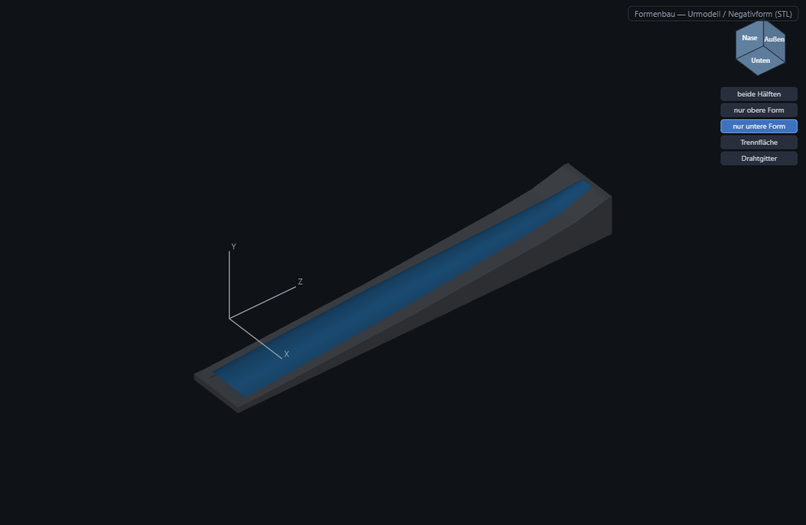

Die untere Formhälfte von schräg oben: der graue Formenrand mit der Trennebene, darin die blaue Kavität, also das Negativ der Flächenunterseite.

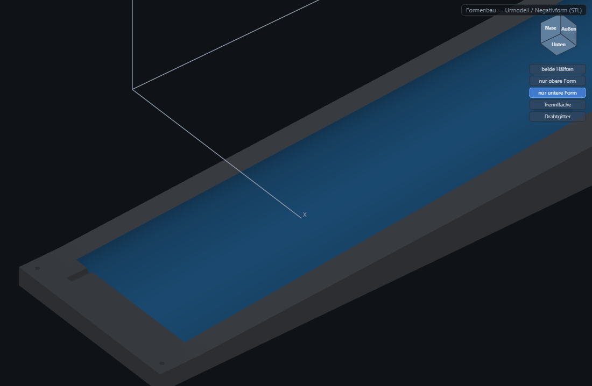

Der Ausschnitt an der Wurzel zeigt die Details: Die Kavität läuft in der **Wurzelverlängerung** über die Wurzelrippe hinaus, links davon liegt die halbe **Ausnehmung für die Steckung** als Nut in der Trennebene, und im Flansch sitzen die **Passbohrungen**.

#### Winglet aus Zeichnung

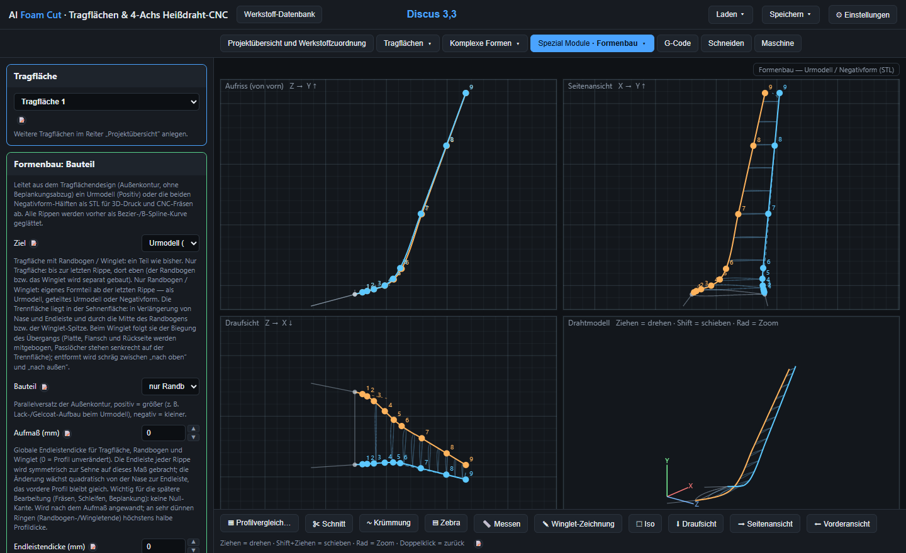

Wer ein Winglet nach einer Vorlage nachbauen will, nimmt **Winglet aus Zeichnung**. Nasen- und Endleistenlinie werden als Raumkurven in einer **Dreitafelprojektion** gezeichnet: im **Aufriss** (Biegung und Neigung), in der **Draufsicht** (Pfeilung und Toe) und in der **Seitenansicht** (Umriss des stehenden Winglets). Rechts unten zeigt ein **Drahtmodell** das Ergebnis räumlich.

- Ein Griff verschiebt nur die beiden Koordinaten der jeweiligen Ansicht. Dadurch bleiben die drei Ansichten immer widerspruchsfrei.
- Punkt 0 sitzt fest am Flügelende, die Kurve schließt tangential an Nasen- bzw. Endleiste an.
- **Kurvenart** – *Spline* (glatt durch die Punkte, Tangenten automatisch oder per Griff) oder *Polylinie* (gerade Strecken).
- **Aus Einstellungen übernehmen** setzt die Punkte auf das parametrische Winglet, als Startpunkt zum Weiterzeichnen.
- **Wurzelprofil erreicht bei** – bis zu welchem Anteil der Winglet-Länge das Flügelprofil stetig ins Winglet-Wurzelprofil übergeht.

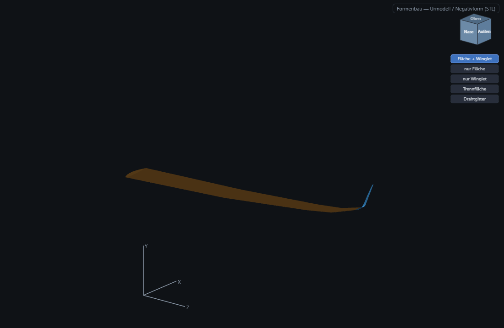

---

## 12. G-Code und Simulation

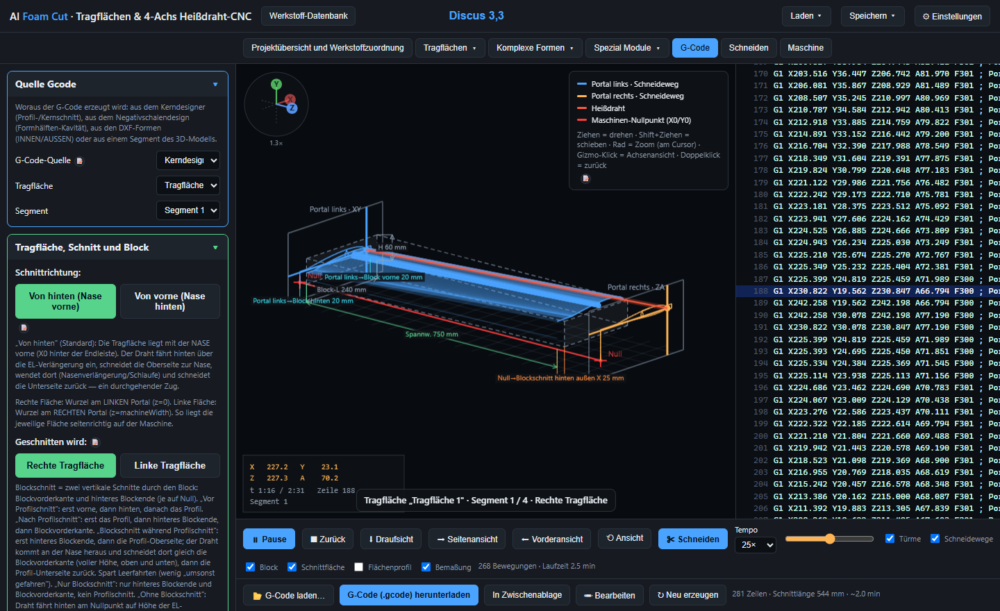

Im Reiter *G-Code* entsteht das Maschinenprogramm. Links die Einstellungen, in der Mitte die **3D-Simulation** mit beiden Portalen, Draht, Block und Schneidewegen, rechts der Programmtext. Die gerade simulierte Zeile ist hervorgehoben und scrollt mit.

- **Quelle Gcode** – woraus der G-Code erzeugt wird: Kerndesign, Negativschalendesign, DXF-Formen, 3D-Modell oder Schriften. Dazu Tragfläche und Segment (oder *Alle*).
- **Tragfläche, Schnitt und Block**
    - **Schnittrichtung** – *von hinten* (Nase vorne, Standard) oder *von vorne*.
    - **Geschnitten wird** – *rechte* oder *linke* Tragfläche, damit jede Seite seitenrichtig auf der Maschine liegt.
    - **Blockschnitt** – vor, nach oder während des Profilschnitts, nur Blockschnitt oder ganz ohne.
    - **Vorschub** und Geschwindigkeit außerhalb des Blocks.
- **Blocklage** – Abstand der Wurzel zum linken Portal (oder mittig), Abstand in Flugrichtung, Höhe über dem Nullpunkt.
- **G-Code / Achsen** – Achsnamen der beiden Türme (Standard X/Y links, Z/A rechts), Nachkommastellen, eigener Header und Footer.

Die Simulation läuft mit dem echten G-Code und den echten Vorschüben, die angezeigte Laufzeit stimmt also mit der Maschine überein. **Tempo** beschleunigt bis 200-fach, Draufsicht, Seiten- und Vorderansicht gibt es per Knopf. Sprünge im Vorschub von mehr als 10 % werden im Programmtext rot markiert, denn sie deuten auf Knicke in der Bahn hin.

Unten: **G-Code herunterladen**, **In Zwischenablage**, **Bearbeiten** (Programmtext von Hand ändern) und **Neu erzeugen**. Mit **✂ Schneiden** oder **Strg+C** geht das Programm direkt in den Reiter *Schneiden*, Quelle und Segment werden mitgenommen.

---

## 13. Schneiden

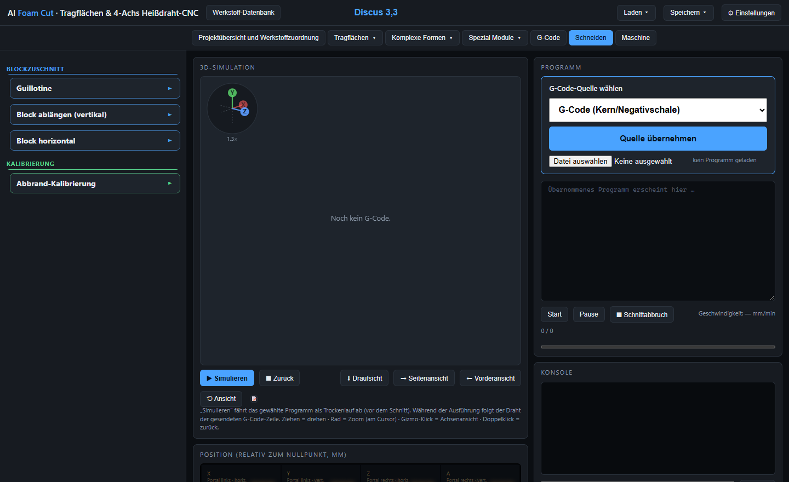

Hier passiert die eigentliche Arbeit an der Maschine. Links die Simulation, die während des Schnitts der Maschine folgt, darunter die Position und die Handfahrt. Rechts die Programmquelle, der Programmtext, Start/Pause/Schnittabbruch und die Konsole.

### 13.1 Blockzuschnitt

In der Seitenleiste gibt es kleine Programme zum Vorbereiten des Blocks:

- **Guillotine** – ein gerader Schnitt von oben nach unten, auch schräg, z. B. um ein Stück abzutrennen.
- **Block ablängen (vertikal)** – zwei senkrechte Schnitte, damit der Block genau die Länge eines Segments hat. Der Abbrand wird dabei schon berücksichtigt.
- **Block horizontal** – den Block auf Höhe abschneiden oder eine Scheibe herausschneiden.

### 13.2 Abbrand kalibrieren (3-Punkt-Kalibrierung)

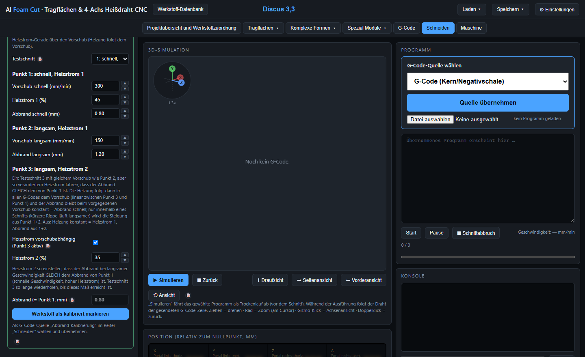

Damit die Teile maßhaltig werden, muss jeder Werkstoff einmal kalibriert werden. Das Programm arbeitet dabei mit **drei Kalibrierpunkten**:

| Punkt | Vorschub | Heizstrom | ergibt |
|---|---|---|---|
| **1** | schnell | Heizstrom 1 | Abbrand schnell |
| **2** | langsam | Heizstrom 1 | Abbrand langsam |
| **3** | langsam | Heizstrom 2 | Heizstrom-Gerade (optional) |

**Punkt 1 und 2** ergeben die **Abbrand-Gerade** über den Vorschub: bei gleichem Heizstrom brennt der Draht langsam breiter als schnell. Damit gleicht das Programm z. B. bei Trapezflächen aus, dass die kürzere Rippe langsamer läuft.

**Punkt 3** ist optional und davon ganz unabhängig. Man schneidet langsam wie bei Punkt 2, aber mit so weit **verringertem Heizstrom**, dass der Abbrand **gleich groß wie bei Punkt 1** ist. Aus Punkt 1 und 3 entsteht die **Heizstrom-Gerade**: Mit dem Schalter *Heizstrom vorschubabhängig (Punkt 3 aktiv)* passt das Programm die Drahtheizung in allen G-Codes an den Vorschub an. Der Abbrand bleibt dann beim eingestellten Vorschub immer gleich (= Abbrand von Punkt 1), egal ob man schnell oder langsam schneidet. Nur innerhalb eines Schnitts, wenn die kürzere Rippe langsamer läuft, wirkt noch die Steigung aus Punkt 1 und 2. Ohne Punkt 3 bleibt die Heizung konstant auf Heizstrom 1.

So geht man vor (Reiter *Schneiden*, Gruppe **Abbrand-Kalibrierung**):

1. Werkstoff wählen und ein **Testrechteck** festlegen (Länge, Höhe, Anzahl übereinander, Abstand, Lage).
2. **Mit Abbrand-Kompensation schneiden** ausschalten. Der Draht fährt dann exakt das Nennmaß, das fertige Rechteck wird um den Abbrand kleiner.
3. **Testschnitt 1: schnell, Heizstrom 1** wählen, **Vorschub schnell** und **Heizstrom 1** eintragen. Als Programmquelle *Abbrand-Kalibrierung* wählen, **Quelle übernehmen**, simulieren, **Start**.
4. Das Rechteck nachmessen: **Abbrand = Nennmaß − Istmaß**. Den Wert in **Abbrand schnell** eintragen.
5. **Testschnitt 2: langsam, Heizstrom 1** mit dem **Vorschub langsam** schneiden, messen, in **Abbrand langsam** eintragen.
6. Optional **Punkt 3 aktivieren** und **Testschnitt 3: langsam, Heizstrom 2** fahren. **Heizstrom 2** so lange verringern und den Schnitt wiederholen, bis das Rechteck **dasselbe Maß wie bei Punkt 1** hat. Der Abbrand von Punkt 3 steht deshalb fest auf dem Wert von Punkt 1.
7. Zur Kontrolle mit eingeschalteter Kompensation noch einmal schneiden. Jetzt muss das Rechteck das Nennmaß haben.
8. **Werkstoff als kalibriert markieren** und danach **Speichern → Einstellungen sichern**.

Faustregel: Die beiden Vorschübe sollten den Bereich einschließen, mit dem man später schneidet, und der langsame nicht unter der Hälfte des schnellen liegen.

### 13.3 Ablauf eines Schnitts

1. Maschine verbinden, Referenzfahrt, Block aufspannen.
2. Wenn nötig den Block ablängen.
3. Den Draht an die hintere untere Blockkante fahren und **Nullpunkt setzen**.
4. Programmquelle wählen, **Quelle übernehmen**, mit **▶ Simulieren** kontrollieren, dann **Start**.

Vor dem Start prüft das Programm, ob alle Fahrwege und Vorschübe innerhalb der Maschinengrenzen liegen. Bei Pausen im Programm (z. B. beim Holmschnitt nach dem Profil) geht es mit **▶ Fortsetzen** weiter. **Schnittabbruch** stoppt sofort. Der Knopf **NOT-HALT** ersetzt aber keinen echten Not-Aus an der Maschine!

---

## 14. Maschine

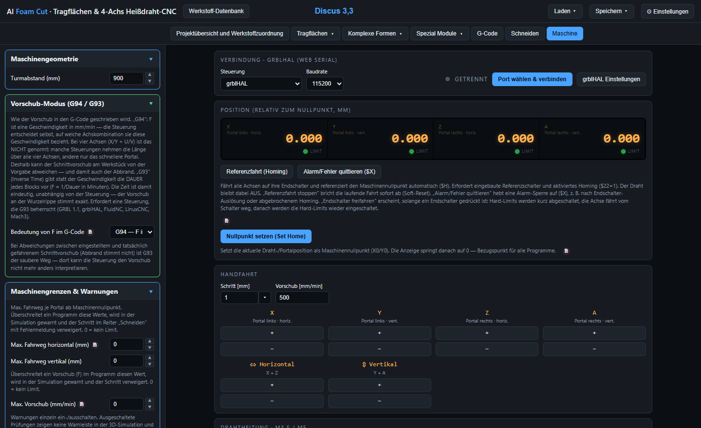

Einmal eingerichtet, braucht man diesen Reiter selten:

- **Maschinengeometrie** – Turmabstand, maximaler Fahrweg horizontal und vertikal, maximaler Vorschub. Überschreitet ein Programm diese Werte, verweigert das Programm den Schnitt. Einzelne Warnungen lassen sich ein- und ausschalten.
- **Vorschub-Modus (G94 / G93)** – bei G94 ist F eine Geschwindigkeit in mm/min, und jede Steuerung legt selbst fest, auf welche Achsen sie sich bezieht. Stimmen eingestellter und tatsächlicher Vorschub nicht überein (und damit auch der Abbrand nicht), ist G93 (Inverse Time) der saubere Weg, sofern die Steuerung es beherrscht.
- **Verbindung** – Steuerung (*grblHAL* oder *Mega 5X*), Baudrate, **Port wählen & verbinden**. Die Verbindung läuft über Web Serial, im Programmfenster ohne weitere Treiber.
- **Referenzfahrt**, **Nullpunkt setzen**, **Alarm quittieren**.
- **Handfahrt** – Schrittweite und Vorschub, jede Achse einzeln oder beide Türme gemeinsam horizontal/vertikal.
- **Drahtheizung** – Schieberegler, *Setzen* und *AUS*.
- **GRBL-Einstellungen ($$)** – alle Einstellungen der Steuerung (Schritte/mm, Beschleunigung, Homing, Endschalter, Achsrichtungen …) direkt aus dem Programm lesen und ändern.
- **Konsole** – beliebige Befehle an die Steuerung schicken.

---

## 15. Anhang: Tipps, Tastenkürzel, Dateiformate

### 15.1 Der typische Weg zum Kern

1. **Werkstoff-Datenbank:** Werkstoff anlegen und kalibrieren, Einstellungen sichern.
2. **Laden:** Tragfläche aus XFLR5, FLZ_Vortex, Planform Creator oder GMFC importieren, oder im Tragflächendesigner selbst anlegen. Fehlende Profile über *Profile (.dat) zuordnen…* nachladen.
3. **Projektübersicht:** Werkstoff und Blockdicke der Tragfläche wählen.
4. **Kerndesign:** Blockzugaben, Schnittverlängerungen und Holme prüfen.
5. **G-Code:** Segment wählen, simulieren.
6. **Schneiden:** Block ablängen, Nullpunkt setzen, Start.

### 15.2 Tastenkürzel

| Taste | Wirkung |
|---|---|
| Strg+S (auch Strg+Umschalt+S) | Projekt speichern, in jedem Reiter |
| Strg+G | zum Reiter *G-Code*, die G-Code-Quelle wird aus dem aktuellen Reiter übernommen (Kern, Negativschale, DXF-Formen, 3D-Modell) |
| Strg+C im Reiter *G-Code* | zum Reiter *Schneiden* mit Übernahme von Quelle und Segment („Cut“). Wirkt nicht, wenn Text markiert ist oder ein Eingabefeld den Fokus hat, normales Kopieren bleibt also erhalten. |
| Strg+Z / Strg+Y | Rückgängig / Wiederholen (Punkte bearbeiten, CAD) |
| Esc | Profil-Editor schließen, laufenden CAD-Befehl abbrechen |
| Enter / Leertaste | CAD: Befehl bestätigen oder letzten Befehl wiederholen |
| F3 / F8 | CAD: Objektfang / Ortho ein und aus |
| Mausrad | Zoom auf den Mauszeiger |
| Ziehen / Shift+Ziehen | 2D: verschieben · 3D: drehen / verschieben |
| Doppelklick | Ansicht zurücksetzen |

Dieselben Sprünge gibt es auch als Knöpfe: **⚙ G-Code** in Kern-, Negativ-, DXF- und 3D-Modell-Ansicht und **✂ Schneiden** im G-Code-Reiter.

### 15.3 Dateiformate

| Format | Wofür |
|---|---|
| `.json` | Projekt, Einstellungen, Werkstoffe |
| `.dat`, `.bez` | Profile (Selig/Lednicer, Bézier) |
| `.xml` | XFLR5-Tragfläche |
| `.csv` | FLZ_Vortex-Geometrie |
| `.pc2` | Planform Creator 2 |
| `.cnc` | GMFC-Projekt (Tragfläche oder Formen, Import und Export) |
| `.dxf`, `.svg` | Konturen, Profile, CAD |
| `.stl` | 3D-Modell (Import), Segmente, Rippen, Urmodell und Formen (Export) |
| `.step` | Formenbau-Export für CAD-Programme |
| `.ttf`, `.otf` | Schriftarten |
| `.gcode`, `.nc`, `.ngc`, `.tap` | Maschinenprogramm |

### 15.4 Koordinaten

Der Nullpunkt liegt **hinten unten**: X=0 hinter dem Block (Endleistenseite), Y=0 an der Blockunterkante bzw. auf der Maschinenbasis. Der linke Turm fährt X (horizontal) und Y (vertikal), der rechte Z (horizontal) und A (vertikal). Die Achsnamen sind im Reiter *G-Code* umstellbar.

---

Viel Spaß beim Schneiden! Fragen, Anregungen und Fehlermeldungen gerne im Forum.
